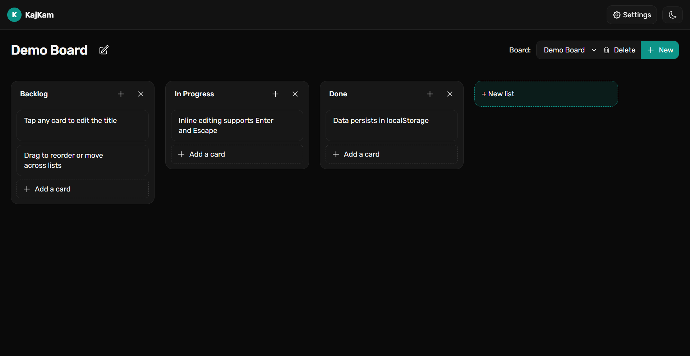

# KajKam

**KajKam** is a modern, fully client-side web application designed to help you organize and manage tasks efficiently. Built with **TailwindCSS v4** and **AlpineJS**, KajKam uses localStorage to persist your data, requiring no backend.

## Features

- **Boards**

  - Create, rename, and delete boards.
  - Board states persist in localStorage.

- **Lists**

  - Add, rename, delete, and reorder lists within boards.
  - List order is fully persistent.

- **Cards**

  - Add, edit inline, delete, and reorder cards.
  - Drag-and-drop cards between lists.
  - Smooth animations for a polished experience.

- **Data Management**

  - Full localStorage persistence for boards, lists, and cards.
  - Optional JSON export/import for backup.

- **UI/UX**

  - Modern, minimalist design.
  - Rounded corners, soft shadows, subtle borders.
  - Single accent color with neutral backgrounds.
  - Dark mode toggle with preference persistence.
  - Responsive and mobile-friendly layout.

- **Extra UX Enhancements**
  - Undo or confirm deletions.
  - Smooth transitions and animations.
  - Keyboard navigation support.

## Usage

Open [KajKam](https://alnahian2003.github.io/kajkam) in your browser. All data is stored locally.

- **Drag-and-Drop:** Move cards within or across lists by dragging.
- **Dark Mode:** Toggle via the top-right corner.
- **Data Backup:** Export current state as JSON and re-import anytime.

## Contributing

Contributions are welcome. Fork the repository, make changes, and submit a pull request.

- Maintain the client-side-only architecture.
- Follow TailwindCSS and AlpineJS conventions.
